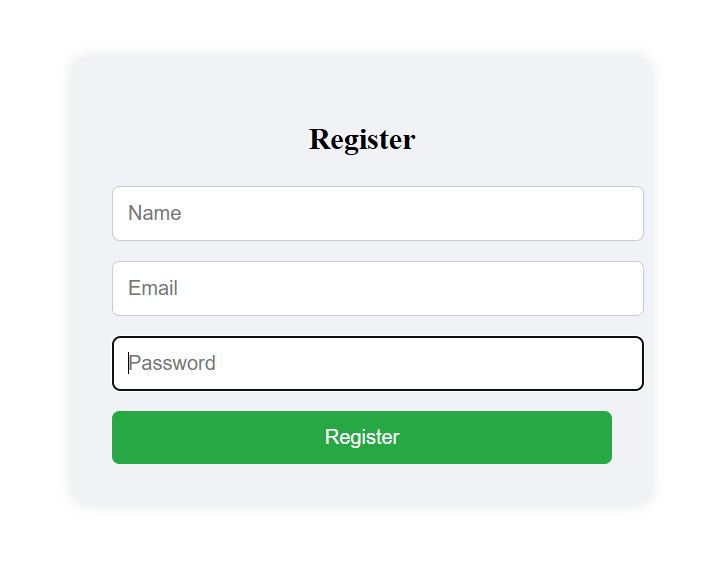
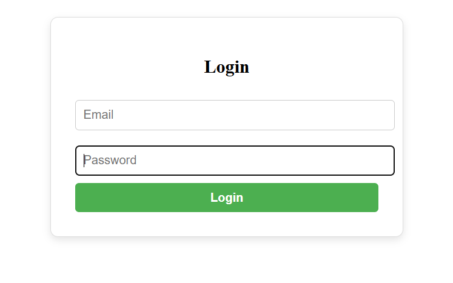
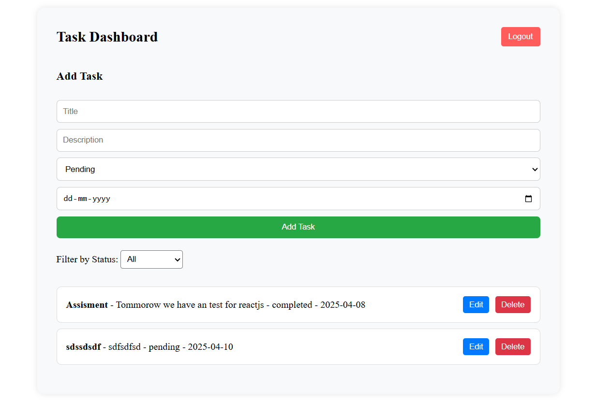

# 📝 Task Manager App

A full-stack Task Manager application built with:

- **Frontend**: React
- **Backend**: Node.js + Express
- **Database**: MySQL
- **Authentication**: JWT
- **Styling**: Custom CSS

---

## 🚀 Features

- User Registration & Login with JWT Authentication
- Create, Edit, Delete Tasks
- Task Statuses: `Pending`, `In-Progress`, `Completed`
- Filter tasks by status
- Task deadlines using due dates
- Secure API with protected routes
- MySQL database with foreign key relationships

---

## 📁 Project Structure

```
/client               # React frontend
  ├── components
  ├── pages
  ├── services
  ├── utils
  └── styles
/server               # Express backend
  ├── controllers
  ├── routes
  ├── models
  ├── middleware
  └── config
```

---

## 🔧 Setup Instructions

### 1. Clone the Repository

```bash
git clone https://github.com/your-username/task-manager-app.git
cd task-manager-app
```

---

### 2. Backend Setup (Node.js)

```bash
cd server
npm install
```

- Create a `.env` file in the `server` directory:

```
DB_HOST=localhost
DB_USER=root
DB_PASS=yourpassword
DB_NAME=taskmanager
JWT_SECRET=your_jwt_secret
PORT=5000
```

- Start the server:

```bash
npm start
```

---

### 3. Frontend Setup (React)

```bash
cd client
npm install
npm start
```

---

## 🛠 API Endpoints

### Authentication

- `POST /auth/register` – Register new user
- `POST /auth/login` – Login and receive token

### Tasks

- `GET /tasks` – Get tasks (authenticated)
- `POST /tasks` – Add task
- `PUT /tasks/:id` – Update task
- `DELETE /tasks/:id` – Delete task

---

## 📦 Dependencies

### Backend

- express
- mysql2
- dotenv
- jsonwebtoken
- bcryptjs
- cors

### Frontend

- axios
- react-router-dom

---

## ✅ To Do

- Add pagination support
- Add search/filter by title
- Add user profile section
- Improve UI with Tailwind or Bootstrap

---

## 📸 Screenshots

> _(Add screenshots of Register, Login, Dashboard, Filter UI)_
## 📸 Screenshots

### 🔐 Register Page


### 🔑 Login Page


### 📋 Dashboard


---


---


This project is licensed under the MIT License.

